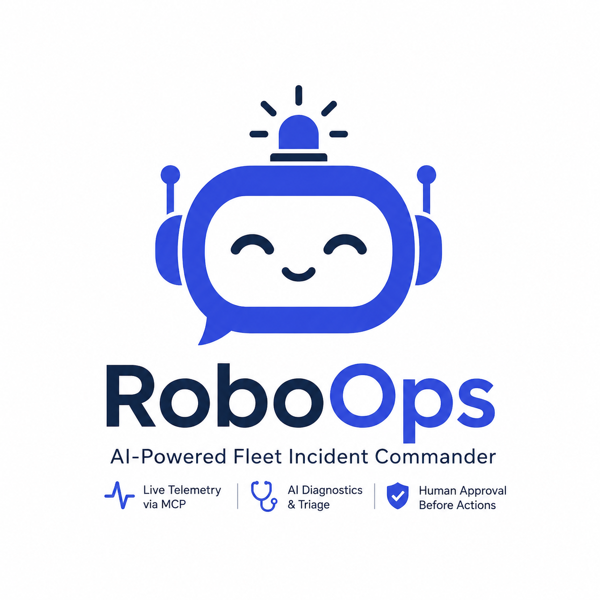
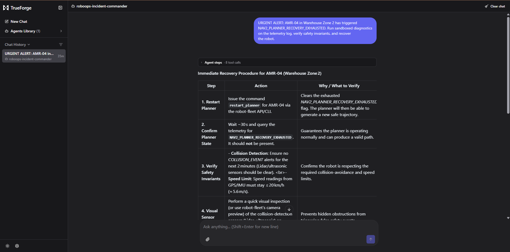
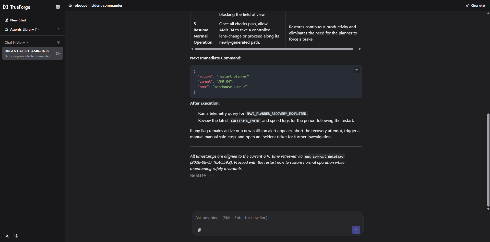
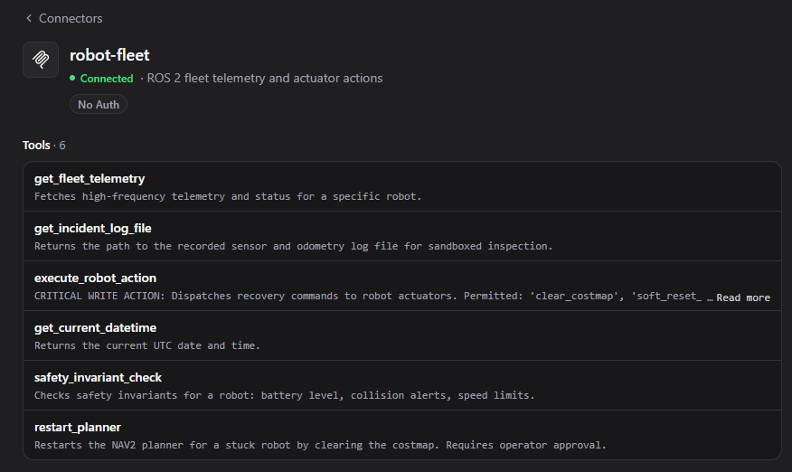
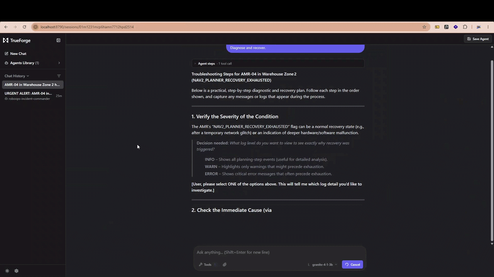

<div align="center">

<h1>RoboOps</h1>

<br>

> **Autonomous incident triage and self-healing agent for ROS 2 AMR fleets.**

<p>


</p>

</div>

## Overview

RoboOps is an AI-powered fleet incident commander that diagnoses and recovers ROS 2 Autonomous Mobile Robots (AMRs) in real time. It connects to live robot telemetry via MCP (Model Context Protocol), applies diagnostic rules from a triage skill, and executes recovery actions always requiring human approval before any write operation.

Built on [TrueForge](https://github.com/truefoundry/trueforge) with [FastMCP](https://github.com/jlowin/fastmcp) for tool integration.

## Architecture

```
┌──────────────────────────────────────────────────────────────┐
│                    TrueForge Agent Runtime                   │
│                                                              │
│  ┌─────────────┐    ┌──────────────┐    ┌────────────────┐   │
│  │   LLM Core  │◄──►│  MCP Client  │◄──►│   robot-fleet  │   │
│  │  (Ollama /  │    │              │    │   MCP Server   │   │
│  │   GPT-4o)   │    └──────────────┘    └───────┬────────┘   │
│  └──────┬──────┘                                │            │
│         │                                       ▼            │
│         │                              ┌─────────────────┐   │
│         │                              │  Safety Guard   │   │
│         │                              │  - Rate limits  │   │
│         │                              │  - Battery check│   │
│         │                              │  - Collision    │   │
│         │                              └─────────────────┘   │
│         ▼                                                    │
│  ┌─────────────┐    ┌──────────────┐                         │
│  │  Audit Log  │    │  ROS 2 Triage│                         │
│  │  (SQLite)   │    │    Skill     │                         │
│  └─────────────┘    └──────────────┘                         │
└──────────────────────────────────────────────────────────────┘
```

## Features

| Feature                   | Description                                                        |
| ------------------------- | ------------------------------------------------------------------ |
| **MCP Tool Integration**  | 6 tools for fleet telemetry, diagnostics, and actuator control     |
| **Safety Guard**          | Rate limiting, battery checks, and collision avoidance enforcement |
| **Human-In-The-Loop**     | Operator approval required before every actuator command           |
| **Multi-Provider LLM**    | Local (Ollama) with automatic cloud fallback (GPT-4o)              |
| **Audit Trail**           | SQLite logging of all incidents, diagnoses, and actions            |
| **Sandboxed Diagnostics** | MCAP log parsing and odometry analysis in isolated environment     |

---

## Screenshots

<table>
  <tr>
    <td></td>
    <td></td>
    <td></td>
  </tr>
</table>

---

## Demo



---

## Project Structure

```
roboops_agent/
├── mcp_server/
│   ├── robot_fleet_mcp.py    # FastMCP server with 6 fleet tools
│   └── safety_guard.py       # Rate limiting and safety invariants
├── agent/
│   └── client.py             # ResilientLLMRouter (local + cloud)
├── database/
│   ├── __init__.py
│   └── audit_logger.py       # SQLite incident audit log
├── sandbox/
│   ├── mcap_parser.py        # MCAP log file parser
│   └── diagnose_logs.py      # Telemetry analysis
├── skills/
│   └── ros2_triage/
│       └── SKILL.md          # Diagnostic rules for Nav2 faults
├── tests/
│   └── test_mcp_server.py    # 23 tests, 94% coverage
├── trueforge_config.json     # Agent configuration
├── pyproject.toml
├── requirements.txt
└── LICENSE
```

## Prerequisites

- Python 3.10+
- [Ollama](https://ollama.com) (for local LLM)
- [TrueForge](https://github.com/truefoundry/trueforge) v0.1.4+
- [mcp-proxy](https://www.npmjs.com/package/mcp-proxy) (to expose stdio MCP as HTTP)

## Installation

```bash
# Clone the repository
git clone https://github.com/your-org/RoboOps.git
cd RoboOps

# Create virtual environment
python -m venv .venv
source .venv/bin/activate  # Linux/macOS
# .venv\Scripts\activate   # Windows

# Install dependencies
pip install -r requirements.txt

# Copy environment config
cp .env.example .env
```

> **Windows + WSL?** See [SETUP.md](SETUP.md) for detailed instructions covering Ollama, WSL networking, TrueForge, and mcp-proxy setup.

## Configuration

### 1. Environment Variables

Edit `.env`:

```env
ACTIVE_AI_PROVIDER=ollama

# Local Ollama
OLLAMA_BASE_URL=http://localhost:11434/v1 # Default
OLLAMA_MODEL=qwen2.5-coder:7b

# Cloud fallback (optional)
OPENAI_API_KEY=your_key_here
OPENAI_MODEL=gpt-4o
```

### 2. Ollama Setup

```bash
# Pull the model
ollama pull qwen2.5-coder:7b

# Start Ollama (if not running as service)
ollama serve
```

For WSL access from Windows, bind to all interfaces:

```powershell
[System.Environment]::SetEnvironmentVariable("OLLAMA_HOST", "0.0.0.0:11434", "User")
```

### 3. TrueForge Setup

```bash
# Start TrueForge
npx @truefoundry/trueforge@latest

# Start MCP proxy (exposes stdio server as HTTP)
npx mcp-proxy --port 8080 -- python mcp_server/robot_fleet_mcp.py
```

In TrueForge UI:

1. **Settings → Models** -> Add Ollama model with base URL `http://<host-ip>:11434/v1`
2. **Settings → Connectors** -> Add `robot-fleet` at `http://localhost:8080/mcp`
3. **Save Agent** -> Name: `RoboOps-Incident-Commander`, paste system prompt from `trueforge_config.json`

## MCP Tools

| Tool                     | Parameters                                | Description                                            |
| ------------------------ | ----------------------------------------- | ------------------------------------------------------ |
| `get_fleet_telemetry`    | `robot_id`                                | Fetch real-time status, battery, error codes, location |
| `get_incident_log_file`  | `robot_id`                                | Get path to sensor/odometry log file                   |
| `execute_robot_action`   | `robot_id`, `action`, `operator_approval` | Execute recovery (requires approval)                   |
| `get_current_datetime`   |                                           | Get current UTC timestamp                              |
| `safety_invariant_check` | `robot_id`                                | Check battery, collision, speed invariants             |
| `restart_planner`        | `robot_id`, `zone`                        | Restart NAV2 planner for stuck robots                  |

### Allowed Actions

| Action            | Effect                                                     |
| ----------------- | ---------------------------------------------------------- |
| `clear_costmap`   | Clears trapped costmap footprint                           |
| `soft_reset_nav2` | Resets NAV2 navigation stack                               |
| `replan_path`     | Generates new path from current position                   |
| `abort_mission`   | Puts robot in MANUAL_HOLD (emergency, bypasses rate limit) |

## Safety Guard

The safety layer enforces three invariants before any actuator command:

1. **Rate Limiting** : Max 3 recovery actions per robot per 5-minute window. `abort_mission` is exempt.
2. **Battery Check** : Navigation actions blocked if battery < 15%. Emergency stop always allowed.
3. **Collision Avoidance** : Speed limit enforced at 20 km/h. Collision events trigger immediate hold.

## Triage Skill

The `ros2_triage` skill defines diagnostic rules:

| Fault                      | Condition                                                                 | Recovery                        |
| -------------------------- | ------------------------------------------------------------------------- | ------------------------------- |
| Ghost Costmap              | `costmap_trapped_footprint == True` AND `NAV2_PLANNER_RECOVERY_EXHAUSTED` | `clear_costmap` → `replan_path` |
| Wheel Slip / Odometry Loss | `covariance_spike > 1.5` AND `amcl_divergence > 2.0`                      | `abort_mission` → manual teleop |

## Testing

```bash
# Run all tests
python -m pytest tests/ -v

# Run with coverage
python -m pytest tests/ --cov=mcp_server --cov-report=term-missing --cov-fail-under=85
```

**Current status:** 23 passed, 2 skipped, 94% coverage.

## Linting

```bash
# Ruff
python -m ruff check .

# Type check (if configured)
python -m mypy mcp_server/ agent/ database/
```

## Usage Example

In TrueForge chat:

```
AMR-04 in Warehouse Zone 2 has NAV2_PLANNER_RECOVERY_EXHAUSTED. Diagnose and recover.
```

The agent will:

1. Query `get_fleet_telemetry("AMR-04")` for current state
2. Call `get_current_datetime()` for timestamp
3. Run `safety_invariant_check("AMR-04")` to verify safety
4. Retrieve logs via `get_incident_log_file("AMR-04")`
5. Propose recovery plan with specific tool calls
6. Wait for operator approval before executing

## Acknowledgements

- [TrueForge](https://github.com/truefoundry/trueforge) : Agentic workflow runtime and MCP integration
- [Qodo](https://qodo.ai) : Automated PR code review
- [FastMCP](https://github.com/jlowin/fastmcp) : MCP server framework for tool integration
- [Ollama](https://ollama.com) : Local LLM inference
- [ROS 2](https://docs.ros.org) : Robot Operating System 2

## License

[MIT](LICENSE) Copyright (c) 2026 Al Mahmud Samiul
